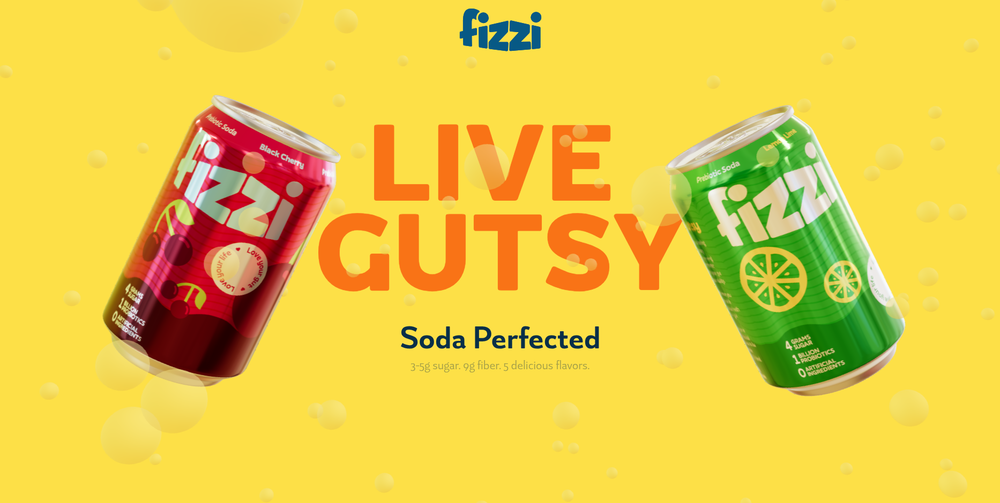

# FizziFresh — 3D Soda Landing Page

Interactive landing page for the fictional **Fizzi** soda brand. Floating 3D cans (React Three Fiber), scroll-driven GSAP animation, and all copy managed in Prismic slices.



## Stack

| Tech | Version |
| --- | --- |
| Next.js (Turbopack) | 16.x |
| React | 19.x |
| Tailwind CSS | 3.4.x |
| Three.js / React Three Fiber / drei | 0.185 / 9.x / 10.x |
| GSAP | 3.15.x |
| Prismic (`@prismicio/*`) | client 7.x |

## Features

- **3D hero cans** — `ViewCanvas` + `FloatingCan` / `SodaCan`, with graceful fallback to a static page when WebGL is unavailable (headless browsers, GPU-less VMs).
- **Prismic slices** — `Hero`, `SkyDive`, `Carousel`, `BigText`, `AlternatingText` (`src/slices`).
- **Live previews & webhooks** — `/api/preview`, `/api/exit-preview`, and tag-based revalidation via `POST /api/revalidate`.
- **Slice Simulator** at `/slice-simulator` for local slice development.

## Getting started

Prerequisites: **Node.js 20 LTS+**.

```bash
git clone https://github.com/TheNeovimmer/fizzifresh.git
cd fizzifresh
npm install --legacy-peer-deps   # required: @react-three/drei peer range conflicts otherwise
npm run next:dev                  # http://localhost:3000
```

`npm run dev` additionally starts Slice Machine alongside Next.js.

## Environment variables

| Variable | Required | Purpose |
| --- | --- | --- |
| `NEXT_PUBLIC_PRISMIC_ENVIRONMENT` | No | Overrides the Prismic repo name (default: `fizzi` from `slicemachine.config.json`). |
| `REVALIDATE_SECRET` | No | Shared secret for `POST /api/revalidate?secret=…`. Set it and point the Prismic webhook there; when unset the endpoint keeps legacy open behavior. |
| `SLICE_SIMULATOR_SECRET` | No | Optional secret gate for `/slice-simulator`. |

## Scripts

| Command | What it does |
| --- | --- |
| `npm run next:dev` | Next.js dev server (Turbopack). |
| `npm run dev` | Dev server + Slice Machine concurrently. |
| `npm run build` / `npm start` | Production build / serve. |
| `npm run slicemachine` | Slice Machine UI only. |
| `npm run lint` / `npm run format` | ESLint / Prettier. |

## Project structure

```
src/
  app/            # routes: page, [uid], api/{preview,revalidate,exit-preview}, slice-simulator
  components/     # ViewCanvas, FloatingCan, SodaCan, Header, Footer, …
  slices/         # Prismic slice components
  prismicio.ts    # Prismic client (routes + fetch caching)
public/fonts/     # Alpino variable font (next/font/local)
```

## Security notes

- **CVE-2025-29927** (Next.js middleware auth bypass) remediated by running Next 16; the repo ships no middleware, as defense in depth.
- Remaining `npm audit` findings are dev-only (Slice Machine's express chain, Tailwind's build-time YAML) with no production runtime exposure.

## Deploy

Works on any Next.js host (Vercel recommended). Set the env vars above, configure the Prismic webhook to `https://<domain>/api/revalidate?secret=<REVALIDATE_SECRET>`, and deploy.

## Contributing

PRs and issues welcome — see [open issues](https://github.com/TheNeovimmer/fizzifresh/issues).

## License

Apache-2.0 — see [LICENSE](./LICENSE).
